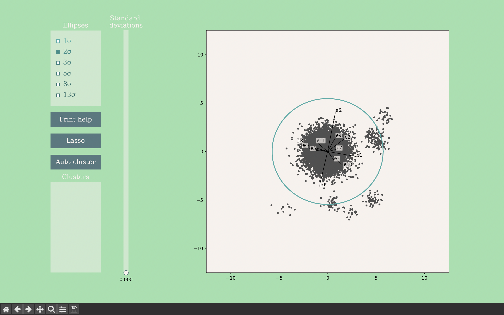
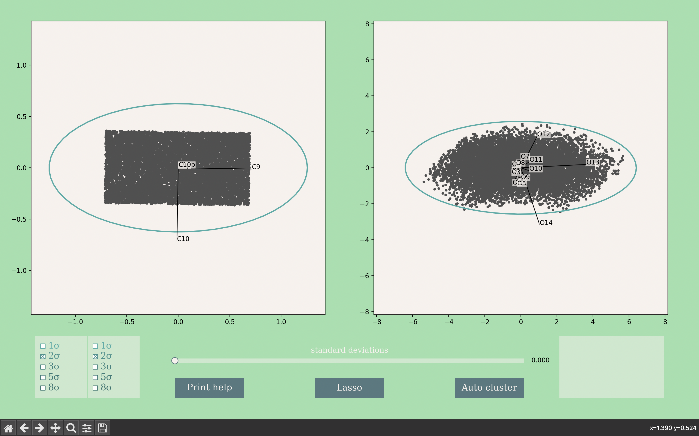

# High-Dimensional-Data-Visualisation
Representing high dimensional data in two dimensions.

## Setting up
Download hddv.zip (66 MB) and double click to extract hddv.exe. It may be helpful to save this application in a folder with your data to shorten the relative path to these files when using the application.

## Adding arguments
Due to its argparse functionality, hddv.exe must be run from the terminal. Open the terminal (Mac) or command line (Windows) and navigate to the location of hddv.exe. 

A basic usage constitutes:
```
./hddv path-to-data-file.csv
```
For example:
```
Annalisas-MBP:~ annalisacalvi$ cd Programs/High-Dimensional-Data-Visualisation/
Annalisas-MBP:High-Dimensional-Data-Visualisation annalisacalvi$ ./hddv /Users/annalisacalvi/Programs/
High-Dimensional-Data-Visualisation/samples/spaced_clusters.csv
Running...
Finding projections...: 100%|█████████████████████████████████████████████████████████████| 20/20 [00:23<00:00,  1.17s/it]
```
Note that this can load for 30 seconds to a minute before printing anything to the terminal. After the "Finding projections" bar reaches 100%, a widget should open, such as

It is recommended to use this app in fullscreen. However, you should still keep an eye on the terminal; some functions will print information there. 

If hddv.exe shares a directory with the data file, you can use the shared path, eg.
```
./hddv samples/spaced_clusters.csv
```
for the same result. Further demonstrations will use relative paths.

There are a number of optional parameters you can use to customise the widget. For a summary, use the command
```
./hddv --help
```
This will print:
```
Running...
usage: hddv [-h] [-sp SHARED_PATH] [-d DEPENDENT_DATA] [-ci COV_INDEPENDENT_DATA]
            [-cd COV_DEPENDENT_DATA] [-mi MEAN_INDEPENDENT_DATA] [-md MEAN_DEPENDENT_DATA]
            data

positional arguments:
  data                  relative path to independent data

options:
  -h, --help            show this help message and exit
  -sp SHARED_PATH, --shared_path SHARED_PATH
                        shared path to all entries, ending with '/'
  -d DEPENDENT_DATA, --dependent_data DEPENDENT_DATA
                        relative path to dependent data
  -ci COV_INDEPENDENT_DATA, --cov_independent_data COV_INDEPENDENT_DATA
                        relative path to covariance matrix for independent data
  -cd COV_DEPENDENT_DATA, --cov_dependent_data COV_DEPENDENT_DATA
                        relative path to covariance matrix for dependent data
  -mi MEAN_INDEPENDENT_DATA, --mean_independent_data MEAN_INDEPENDENT_DATA
                        relative path to ellipse centre for independent data
  -md MEAN_DEPENDENT_DATA, --mean_dependent_data MEAN_DEPENDENT_DATA
                        relative path to ellipse centre for dependent data
```

These methods are explained in further detail below.

### Specifying a covariance matrix
When only one dataset is being analysed, only tags mentioning independent data are relevant. We use the optional parameter ```-ci``` to specify a data file for the covariance matrix.

Syntax:
```
./hddv path-to-data-file.csv -ci path-to-covariance-matrix.csv
```

For example, we could run:
```
./hddv samples/p5pexample/np.csv -ci samples/p5pexample/cov_mat.csv
```

When we are using several data files in the same folder, we can shorten this command by using the ```-sp```, or ```--shared_path```, option:

```
./hddv -sp samples/p5pexample/ np.csv -ci cov_mat.csv
```

This reads ```np.csv``` as our data, ```cov_mat.csv``` as our covariance matrix, and pastes ```samples/p5pexample/``` in front of both these names when reading from the files.

### Specifying the centre

Just like the covariance matrix, we use an optional parameter ```-mi``` to specify the centre of our ellipses.

Syntax:
```
./hddv path-to-data-file.csv -mi path-to-centre.csv
```

We can include as many optional parameters as we like. For example, we can specify a covariance matrix and a centroid, using a shared path as follows:
```
./hddv -sp samples/p5pexample/ np.csv -ci cov_mat.csv -mi centre_of_ellipses.csv
```

### Adding a dependent set of data

You can view two linked datasets side by side, as long as they have the same number of points. This can be useful for analysing functions. In the widget, one dataset (specified as independent) can be manoeuvred freely using lasso select and clustering, and the dataset specified as dependent will colour its linked points accordingly. Two points are 'linked' if they have the same position (disregarding headers) in their respective CSV files. For more information about required data formats, see ___.

Dependent data is specified using the optional parameter ```-d```. For example:
```
./hddv -sp samples/bphys/ testinput.csv -d testoutput.csv
```
This yields a different looking widget:


The plot on the left shows the independent data, and the plot on the right shows the dependent data. 
A covariance matrix and centre can be specified for dependent data as well, using the options ```-cd``` and ```-md``` respectively. These have no effect if a dependent dataset is not specified.

## Valid CSV formats

All CSV files should be comma-delimited.

### For datasets

Datasets may have one header line. Headers should not be numbers, or the header line will be read as an additional datapoint. It is also recommended that headers are short, say 1-4 letters, as they are used to label the axes on the plot.

Any additional columns, such as ids for the points or a clustering index, will show up as additional dimensions, and should not be present. Each column should represent a parameter and each row (except the optional header) should represent a point in that parameter space.

For linked datasets, the independent and dependent data must be in two separate files, and have the same number of lines minus headers. Order is important; points are linked to each other by their line number (minus headers).

### For the covariance matrix

A $p\times p$ covariance matrix should have exactly $p$ columns and $p$ rows, with no headers, identifiers, or other additional information. The matrix itself must be symmetric and positive-definite.

### For the centre

A $p$ dimensional centre consists of $p$ numbers. It is equally valid for this to be in one row or one column. Again, no additional information should be present.


